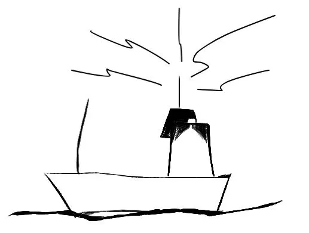
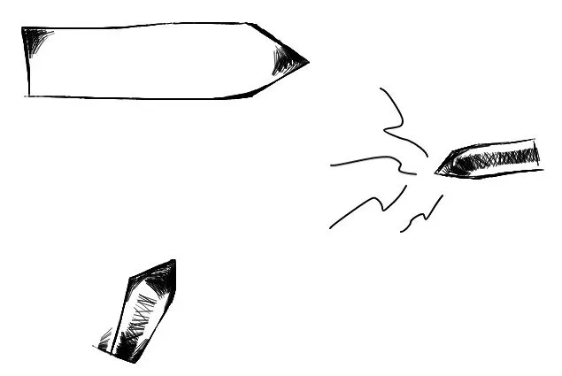
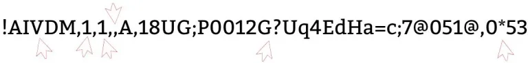

# What is AIS?

**Published:** 2019-08-01

Automatic Identification System (AIS) is a radio-based system used by ships to exchange short maritime safety and navigation messages over VHF. Ships larger than 300 BRT and passenger vessels are generally required to transmit AIS data periodically.



AIS messages carry information such as vessel identity, position, speed, course, draught, cargo, and voyage data. The primary purpose is collision avoidance and situational awareness, not just identification. Because AIS works over VHF radio, vessels can exchange information directly without relying on land-based infrastructure.



The VHF bandwidth is limited, so AIS messages are compact and optimized for efficient airtime usage even in congested waters.

## Receiving AIS messages

AIS messages are not encrypted. Anyone with suitable receiving equipment can collect them, typically within about 50 kilometers or 30 nautical miles depending on local conditions. Sources include:

- dedicated AIS receivers
- exchange services such as AIShub
- commercial feeds such as MarineTraffic or VT Explorer

Most receivers expose AIS data as **NMEA-armoured messages** such as:

```text
!AIVDM,1,1,,A,18UG;P0012G?Uq4EdHa=c;7@051@,0*53
```

## Anatomy of an AIS NMEA sentence

An NMEA AIS sentence is a comma-separated record:



- `!AIVDM` is the NMEA message type.
- The first `1` is the number of fragments for the AIS message.
- The second `1` is the fragment number.
- The blank field is an optional sequence identifier.
- `A` is the radio channel.
- `18UG;P0012G?Uq4EdHa=c;7@051@` is the AIS payload encoded in 6-bit ASCII.
- `0*53` contains fill bits and checksum.

Some AIS messages fit into a single NMEA sentence. Others need two fragments before they can be decoded into one AIS message.

## AIS message types

AIS defines many message types. Common examples include:

- types 1, 2, and 3: position reports
- type 5: static and voyage-related data
- types 6 and 8: binary and application-specific payloads

The detailed specification is defined in ITU-R M.1371.

## Decoding with AISmessages

AISmessages decodes NMEA-armoured AIS payloads into Java objects so callers do not need to handle the bit-level parsing themselves.

For example, the message above can be decoded into structured data like:

```json
{
  "messageType": "PositionReportClassAScheduled",
  "navigationStatus": "UnderwayUsingEngine",
  "rateOfTurn": 0,
  "speedOverGround": 6.6,
  "positionAccuracy": false,
  "latitude": 37.912167,
  "longitude": -122.42299,
  "courseOverGround": 350.0,
  "trueHeading": 355,
  "specialManeuverIndicator": "NotAvailable",
  "raimFlag": false,
  "communicationState": {
    "syncState": "UTCDirect",
    "slotTimeout": 1,
    "numberOfReceivedStations": null,
    "slotNumber": null,
    "utcHour": 8,
    "utcMinute": 20,
    "slotOffset": null
  },
  "second": 40,
  "repeatIndicator": 0,
  "sourceMmsi": {
    "mmsi": 576048000
  },
  "valid": true
}
```

## Related documentation

- [Creating a Spring Boot based AIS message decoder](../tutorials/spring-boot-decoder.md)
- [AIS Application-Specific Messages](application-specific-messages.md)

## Important resources

- [ITU-R M.1371 AIS specification](http://www.itu.int/rec/R-REC-M.1371-5-201402-I)
- [AIVDM/AIVDO protocol decoding](https://gpsd.gitlab.io/gpsd/AIVDM.html) by Eric S. Raymond
- [The Toils of AIS](http://vislab-ccom.unh.edu/~schwehr/papers/toils.txt) by Eric S. Raymond and Kurt Schwehr
