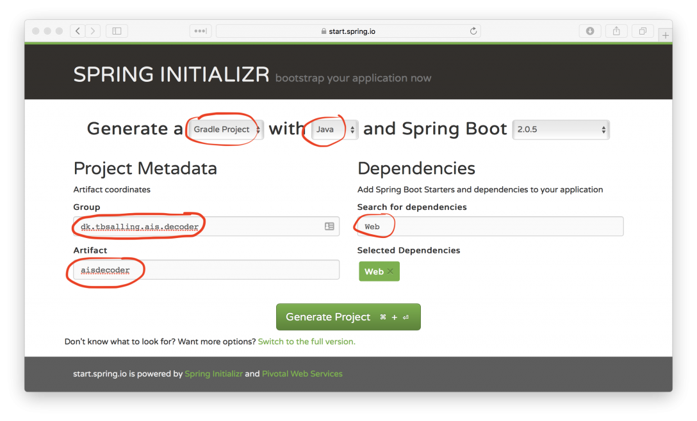

# Creating a Spring Boot based AIS message decoder

**Published:** 2018-09-13
**Updated:** 2026-04-26

This tutorial shows how to build a small Spring Boot service that accepts a JSON array of NMEA strings and responds with decoded AIS messages in JSON format.

## Target API

Request:

```text
POST http://localhost:8080/decode
Content-Type: application/json

[
  "!AIVDM,1,1,,A,18UG;P0012G?Uq4EdHa=c;7@051@,0*53",
  "!AIVDM,2,1,0,B,539S:k40000000c3G04PPh63<00000000080000o1PVG2uGD:00000000000,0*34",
  "!AIVDM,2,2,0,B,00000000000,2*27"
]
```

Response shape:

```json
[
  {
    "repeatIndicator": 0,
    "sourceMmsi": { "mmsi": 576048000 },
    "navigationStatus": "UnderwayUsingEngine",
    "rateOfTurn": 0,
    "speedOverGround": 6.6,
    "positionAccuracy": false,
    "latitude": 37.912167,
    "longitude": -122.42299,
    "courseOverGround": 350.0,
    "trueHeading": 355,
    "second": 40,
    "specialManeuverIndicator": "NotAvailable",
    "raimFlag": false,
    "messageType": "PositionReportClassAScheduled",
    "transponderClass": "A",
    "valid": true
  }
]
```

## Initialize the Spring Boot project

Generate a Spring Boot 3 project from `https://start.spring.io` using Java 21 and the `web` starter, then verify that the unmodified application builds and runs.



## Add AISmessages as a dependency

Add AISmessages to your build. If a newer release is available in Maven Central, prefer that over the version shown here.

```xml
<dependency>
    <groupId>dk.tbsalling</groupId>
    <artifactId>aismessages</artifactId>
    <version>4.1.0</version>
</dependency>
```

For Gradle:

```groovy
dependencies {
  implementation group: 'dk.tbsalling', name: 'aismessages', version: '4.1.0'
}
```

## Add the controller

```java
import dk.tbsalling.aismessages.ais.messages.AISMessage;
import org.springframework.http.MediaType;
import org.springframework.web.bind.annotation.PostMapping;
import org.springframework.web.bind.annotation.RequestBody;
import org.springframework.web.bind.annotation.RequestMapping;
import org.springframework.web.bind.annotation.RestController;

import java.util.List;

@RestController
@RequestMapping("/decode")
public class AisdecoderController {
    private final AisdecoderService aisdecoderService;

    public AisdecoderController(AisdecoderService aisdecoderService) {
        this.aisdecoderService = aisdecoderService;
    }

    @PostMapping(
        consumes = MediaType.APPLICATION_JSON_VALUE,
        produces = MediaType.APPLICATION_JSON_VALUE
    )
    public List<AISMessage> decode(@RequestBody List<String> nmea) {
        return aisdecoderService.decode(nmea);
    }
}
```

## Add the decode service

The core idea is to feed each input NMEA sentence into `NMEAMessageHandler`, which reconstructs complete AIS messages and emits them via a callback.

```java
import dk.tbsalling.aismessages.ais.messages.AISMessage;
import dk.tbsalling.aismessages.nmea.NMEAMessageHandler;
import dk.tbsalling.aismessages.nmea.messages.NMEAMessage;
import org.springframework.stereotype.Service;

import java.util.ArrayList;
import java.util.List;

@Service
public class AisdecoderService {

    public List<AISMessage> decode(List<String> nmeaMessagesAsStrings) {
        List<AISMessage> aisMessages = new ArrayList<>();
        NMEAMessageHandler nmeaMessageHandler = new NMEAMessageHandler("HTTP", aisMessages::add);

        nmeaMessagesAsStrings.forEach(nmeaMessageAsString -> {
            NMEAMessage nmeaMessage = new NMEAMessage(nmeaMessageAsString);
            nmeaMessageHandler.accept(nmeaMessage);
        });

        List<NMEAMessage> unparsedMessages = nmeaMessageHandler.flush();
        if (!unparsedMessages.isEmpty()) {
            throw new IllegalArgumentException("Incomplete AIS message fragments in request.");
        }

        return aisMessages;
    }
}
```

## Why `NMEAMessageHandler` matters

AIS-to-NMEA is not always a 1:1 mapping. Some AIS payloads require multiple NMEA fragments. `NMEAMessageHandler` keeps track of those fragments and only emits a decoded AIS message when all required fragments have been received.

For continuous streams, prefer `AISInputStreamReader`. For HTTP batch decoding, `NMEAMessageHandler` gives you precise control over fragment boundaries and leftover partial messages.

## Run the service

Run the Spring Boot application with Maven or Gradle. For Maven:

```text
$ ./mvnw spring-boot:run
```

Then call the service:

```text
$ curl -X POST http://localhost:8080/decode \
    -H 'Content-Type: application/json' \
    -d '[ "!AIVDM,1,1,,A,18UG;P0012G?Uq4EdHa=c;7@051@,0*53" ]'
```

## Related tutorials

- [What is AIS?](../articles/what-is-ais.md)
- [Creating, sharing, and running a Docker image to decode AIS messages](docker-decoder.md)
- [Running AISdecoder in a Kubernetes cluster on AWS](kubernetes-on-aws.md)
